= CompletableFuture
:icons: font
:hardbreaks:
:sectlinks:
:sectnums:
:stem:

== 背景

=== 同步VS异步

==== 同步

> 同步任务创建后, 调用方等待调用结果返回.

==== 异步

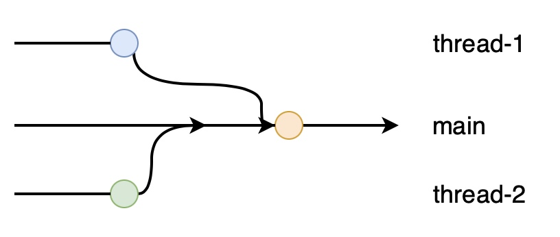

> 异步任务创建后立即返回, 任务完成后通知或者回调调用方.

=== Future<V>

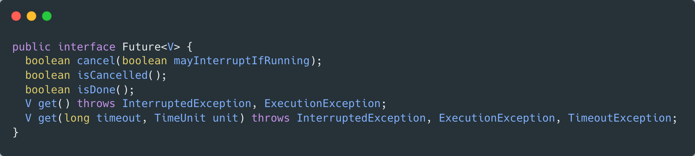

==== 代码示例

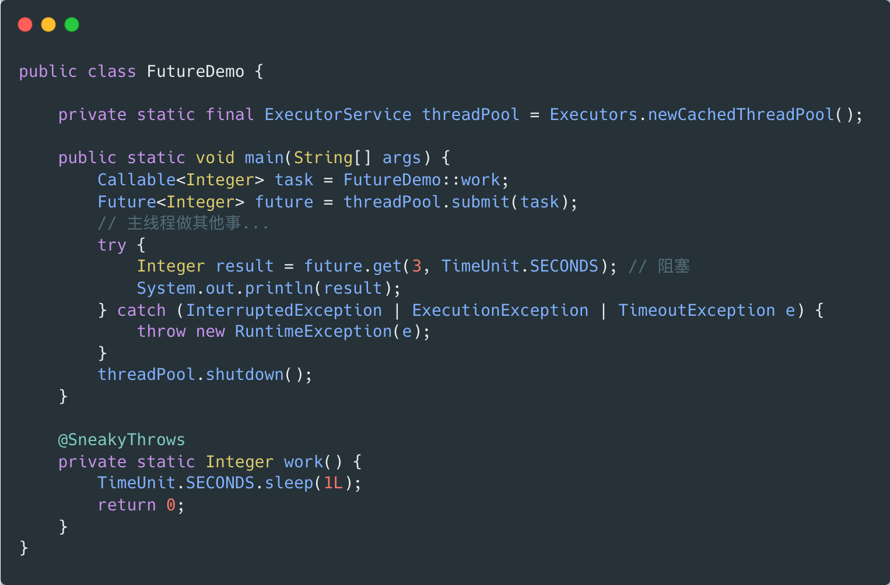

==== 缺点

* 缺少结果通知机制
* 缺少异常通知机制
* 难以协调多个异步任务

=== ListenableFuture

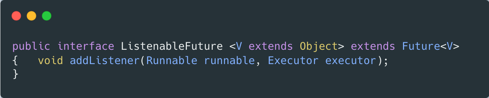

==== 代码示例

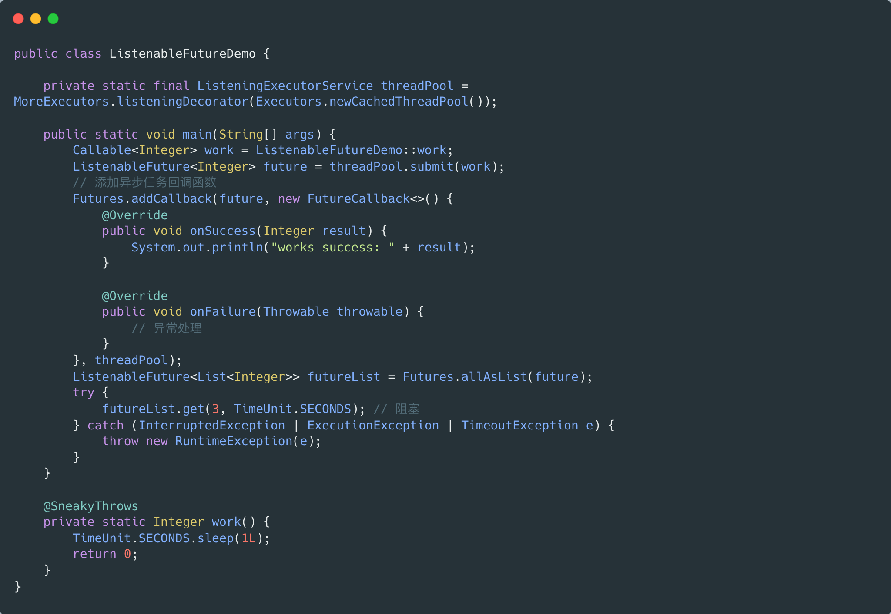

完善了异步任务完成和异常情况下的回调处理, 但仍然难以协调多个异步任务.

=== CompletableFuture

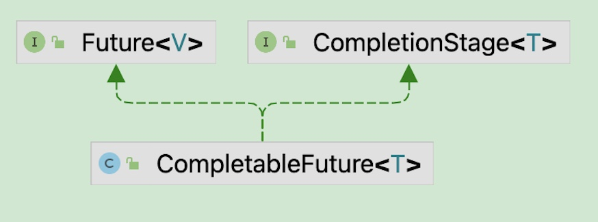

`CompletableFuture` 对 `Future` 进行了扩展, 提供了一大批创建/编排/组合异步任务的方法, 同时支持异常回调, 在一定程度上解决了回调地狱的问题.

== 使用介绍

=== 创建CompletableFuture

* `public static CompletableFuture runAsync(Runnable)`
* `public static CompletableFuture supplyAsync(Supplier)`
* `public static CompletableFuture completedFuture(U)`

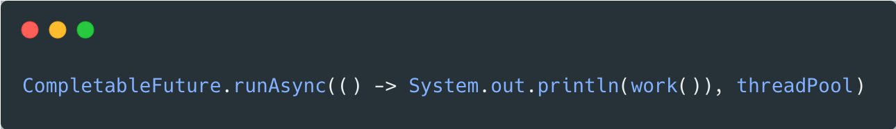

=== 获取任务状态

* `boolean isDone()`
* `boolean isCompletedExceptionally()`
* `boolean isCancelled()`

=== 获取任务结果

* `T get()`
* `T get(long, TimeUnit)`
* `T getNow(T)`
* `void join()`

=== CompletionStage方法模板

`CompletionStage` 一共包含 stem:[14xx3+1]个方法.

* `CompletionStage somethingAsync(..., Executor);` 由指定的线程池执行任务.
* `CompletionStage somethingAsync(...);` 由 `ForJoinPool` 或者新建线程执行任务.
* `CompletionStage something(...);` 由调用方线程执行任务.
* `CompletableFuture<T> toCompletableFuture();`

异步任务通过 `lambda` 函数接口抽象出来:

* Apply: `Function, BiFunction`
* Accept: `Consumer, BiConsumer`
* Run: `Runnable`

=== 链接(1->1)

* `thenApply(Function);`
* `thenAccept(Consumer);`
* `thenRun(Runnable);`

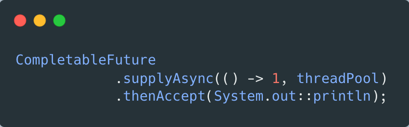

=== 转换(2->1)

.and
* `thenCombine(CompletionStage, BiFunction);`
* `thenAcceptBoth(CompletionStage, BiConsumer);`
* `runAfterBoth(CompletionStage, Runnable);`

.or
* `applyToEither(CompletionStage, Function);`
* `acceptEither(CompletionStage, Consumer);`
* `runAfterEither(CompletionStage, Runnable);`

.异步任务组装
* `CompletionStage thenCompose(Function);`

=== 异常处理

* `handle(BiFunction<T, Throwable, U>);` 异常处理/任务结果转换
* `whenComplete(BiConsumer<T, Throwable>);` 异常处理/任务结果处理
* `exceptionally(Function<Throwable, T>);` 异常处理/自定义任务结果
* `exceptionallyCompose(Function<Throwable, CompletionStage>);` 异常处理/组装新的异步任务

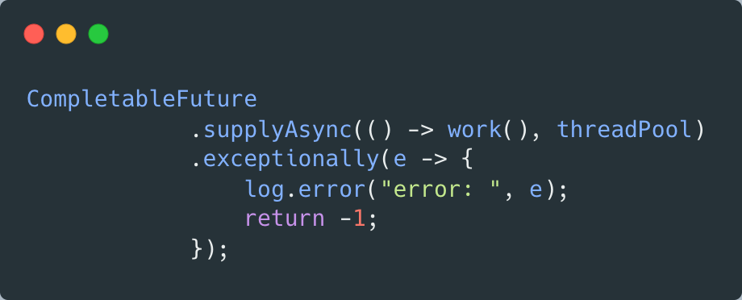

|===
| 场景 | `handle` | `whenComplete` | `exceptionally(Compose)`

| 任务成功后回调
| √
| √
| x

| 任务异常后回调
| √
| √
| √

| 异常后能返回自定义的任务结果
| √
| x
| √

| 异常后能返回新的任务结果类型
| √
| x
| x

|===

=== 超时处理

* `CompletableFuture orTimeout(long, TimeUnit)` 到达超时时间后取消任务
* `CompletableFuture completeOnTimeout(T, long, TimeUnit)` 到达超时时间后返回自定义的任务结果

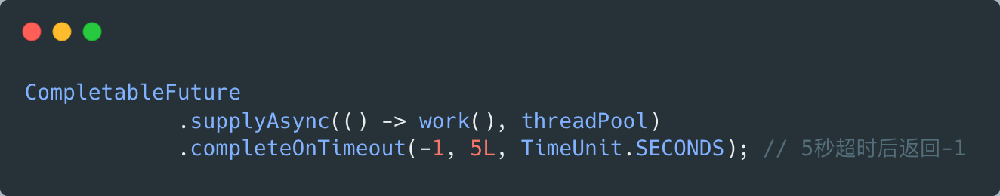

=== allOf

* `public static CompletableFuture allOf(CompletableFuture...)`

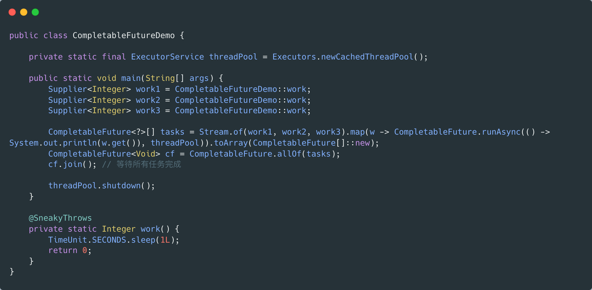

=== anyOf

* `public static CompletableFuture anyOf(CompletableFuture...)`

== 常见问题

=== 缺少异常处理

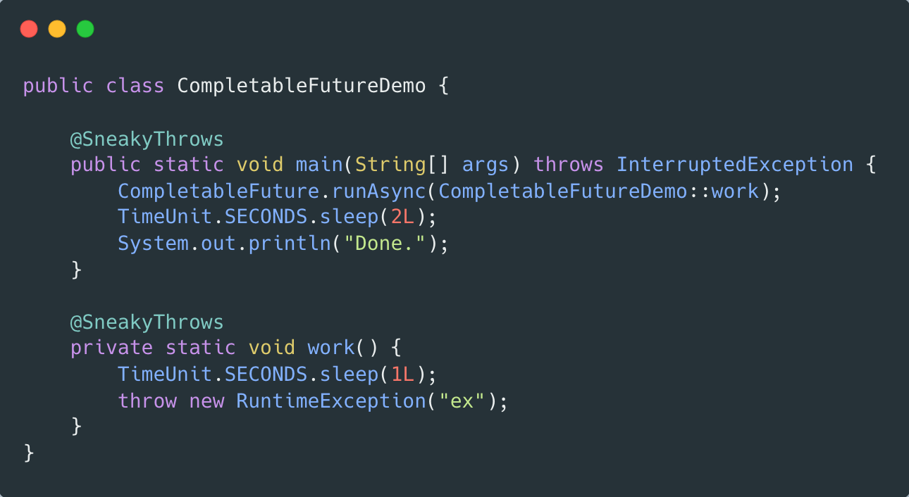

=== 不指定线程池

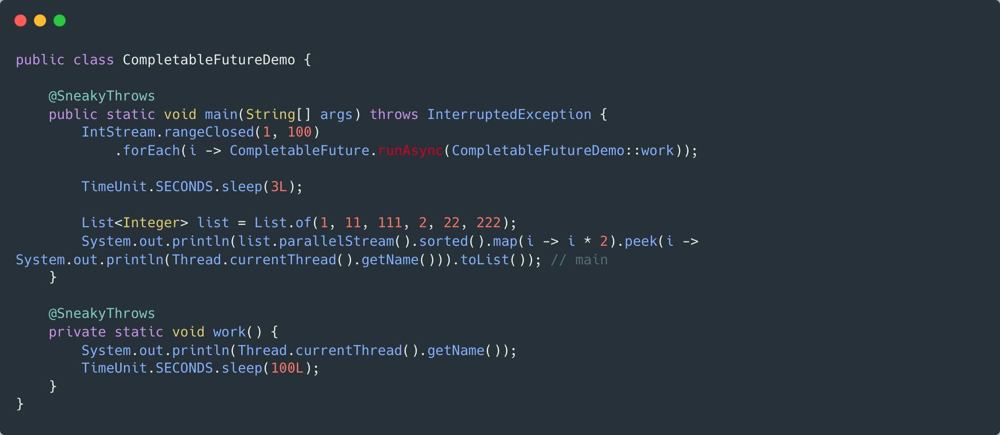

=== 串行化批处理任务

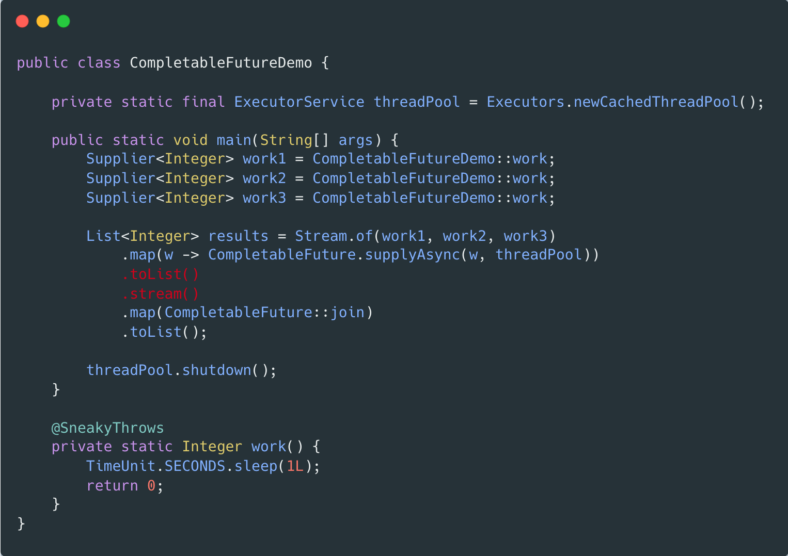

== 原理介绍

== 总结

* 丰富的异步任务API, 覆盖链式任务, 组合任务等场景.
* 命令式操纵异步线程.
* 异常处理.
