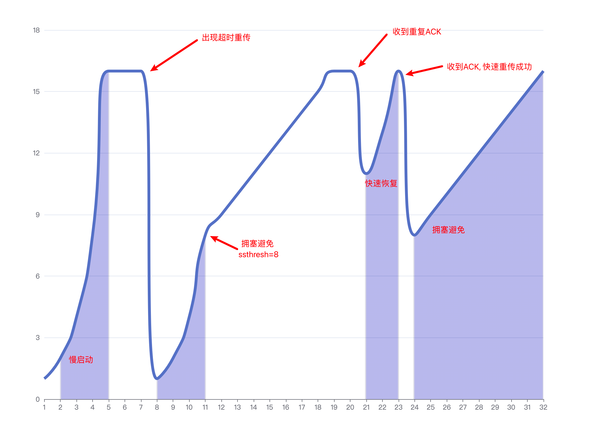

= TCP
:icons: font
:source-highlighter: highlightjs
:highlightjs-theme: idea
:sectlinks:
:sectnums:
:stem:
:toc: left
:toclevels: 3
:toc-title: 目录
:tabsize: 4
:docinfo: shared

== 协议分层模型

|===
| OSI参考模型 | TCP/IP参考模型 | 常见协议

| 应用层
.3+|应用层

.3+|HTTP FTP SMTP SSH

| 表示层

| 会话层

| 传输层

| 传输层

| TCP UDP RTP SCTP

| 网络层

| 互联网层

| IP ICMP

| 数据链路层

.2+|网络接口层

.2+| IEEE802.3 IEEE802.11

| 物理层

|===

[cols="^1,^1,^2,^2,^4"]
.数据包格式
|===
| 以太网首部 | IP首部 | TCP首部 | HTTP请求/响应头 | 数据

.3+| L2
| L3
| L4
| L7
| 应用程序

| <20字节>
| <20~60字节>
2+|<MSS>

4+| <MTU: 1500/9000>

|===

== TCP协议简介

> `TCP` 是一种面向连接的、可靠的、有序的、基于字节流的传输层通信协议. [RFC9293]

* 面向连接: 确认通信设备间连接的开始和结束, 同时通过拥塞控制机制保障端到端的高可靠通信.
* 可靠的: 通过ACK确认机制确保数据传输完成.
* 有序的: 通过SEQ机制对收到的分段顺序进行管理.
* 基于字节流: 无边界.

=== 报文格式

[packetdiag,tcp-header,svg]
----
packetdiag {
  colwidth = 32;
  node_height = 60;
  default_fontsize = 16;

  0-15: 发  送  方  口  号;
  16-31: 目  的  地  端 口  号;
  32-63: 序  列  号(SEQ);
  64-95: 确  认  应  答  号(ACK);
  96-99: 数  据  偏  移;
  100-103: 保  留  位;
  104: CWR [rotate = 270];
  105: ECE [rotate = 270];
  106: URG [rotate = 270];
  107: ACK [rotate = 270];
  108: PSH [rotate = 270];
  109: RST [rotate = 270];
  110: SYN [rotate = 270];
  111: FIN [rotate = 270];
  112-127: 窗  口  大  小;
  128-143: 校  验  和;
  144-159: 紧  急  指  针;
  160-191: 选  项   |   填  充;
  192-223: 数  据 [colheight = 3];
}
----

== TCP连接

=== 握手流程

==== 标准三次握手流程

[plantuml,3whs,svg]
----
@startuml

participant Client
participant Server

Server -> Server: bind()
Server -> Server: listen()

group 三次握手
Client -> Server: SYN\nseq=x
note over Client: [SYN_SENT]
/note over Server: [SYN_RECV]
note over Server
Syn Queue
end note
Server -> Client: SYN, ACK\nseq=y, ack=x+1
note over Client: [ESTABLISHED]
Client -> Server: ACK\nseq=x+1, ack=y+1
/note over Server: [ESTABLISHED]
note over Server
Accept Queue
end note
end

Server -> Server: accept()
Client -> Server: write()
Server -> Server: read()

@enduml
----

[NOTE]
====
* 如果发送SYN包没有收到ACK, 则会经过 stem:["RTO"] 秒后重传, 如果依然没有收到则会经过 stem:[2xx"RTO"] 秒后重传, 以此类推, 可以通过系统变量 `net.ipv4.tcp_syn_retries` 设置最大SYN包重传次数, `net.ipv4.tcp_synack_retries` 设置最大SYN+ACK包重传次数.
* 当服务端收到SYN包后, 会检查 `半连接队列` 参数 `net.ipv4.tcp_max_syn_backlog`/`net.core.somaxconn`/`backlog` , 如果半连接数超过了这一阈值, 会拒绝该连接.
* 响应ACK, 将连接加入到 `全连接队列` 时, 会检查 `全连接队列` 参数 `net.core.somaxconn`/`backlog` , 如果全连接数超过了这一阈值, 会拒绝该连接.
* 建立连接后, 经过 (tcp_keepalive_time + net.ipv4.tcp_keepalive_intvl * net.ipv4.tcp_keepalive_probes) 秒后无响应则会关闭连接.
* 建立后的连接收发包会固定在一个CPU核上进行.
* 如果半连接队列/全连接队列满了, 会导致第一次握手SYN丢包或者第三次握手ACK"丢包"/收到RST包(设置了 `tcp_abort_on_overflow=1`), 一直重试.
检查方式:
** `ss -lnt`
** `watch 'netstat -s | grep overflowed'`
** `ss -antp | grep SYN-RECV | wc -l`
====

==== 双向同时握手

[plantuml,simultaneous-connection-syn,svg]
----
@startuml

!pragma teoz true

participant A as "Client"
participant B as "Server"

A ->(30) B: SYN=1, seq=100\n
& B ->(30) A: SYN=1, seq=300
note over A: [SYN_SENT]
/note over B: [SYN_SENT]
note over B: [SYN_RECV]
/note over A: [SYN_RECV]
B -> A: SYN, ACK\nseq=300, ack=101
A -> B: SYN, ACK\nseq=100, ack=301
note over A: [ESTABLISHED]
note over B: [ESTABLISHED]

@enduml
----

==== Half Open (异常端发起握手)

[plantuml,half-open-connection-discovery,svg]
----
@startuml

hide footbox
!pragma teoz true

participant A as "Client\n [CLOSED]"
participant B as "Server\n [ESTABLISHED]"

A --> B: SYN\nseq=400
note over A: [SYN_SENT]
B -> A: ACK\nseq=300, ack=100
A -> B: RST\nSEQ=100
note over B: [CLOSED]
A -> B: SYN\nseq=400
note over B: [SYN_RECV]
...三次握手...

@enduml
----

==== Half Open (异常端收到报文)

[plantuml,active-side-causes-half-open,svg]
----
@startuml

hide footbox
!pragma teoz true

participant A as "Client\n [CLOSED]"
participant B as "Server\n [ESTABLISHED]"

B -> A: ACK\nseq=300, ack=100
A -> B: RST\nSEQ=100
note over B: [CLOSED]
...三次握手...

@enduml
----

==== 旧SYN包到达

[plantuml,old-duplicate-syn-initiates,svg]
----
@startuml

hide footbox
!pragma teoz true

participant A as "Client\n [LISTEN]"
participant B as "Server\n [LISTEN]"

A -> B: ACK\nseq=300, ack=100
note over B: [SYN_RECV]
B -> A: SYN, ACK\nseq=400,ack=301
A -> B: RST\nSEQ=301
note over B: [LISTEN]

@enduml
----

==== TCP FastOpen (RFC 7413)

`net.ipv4.tcp_fastopen = 3`

[plantuml,tcp-fast-open,svg]
----
@startuml

participant A as "Client"
participant B as "Server"

A -> B: SYN, CookieOpt=nil
B -> A: SYN, ACK\nCookieOpt=C
A -> B: ACK
...建立另一条连接...
A -> B: SYN, CookieOpt=C, DATA_A\nsyn=x
B -> A: SYN, ACK\nsyn=y, ack=x+length(DATA_A)+1
B -> A: PSH, ACK, DATA_B\nack=x+length(DATA_A)+1
A -> B: ACK\nack=y+1
A -> B: ACK\nack=y+leng(DATA_B)+1

@enduml
----

=== 挥手流程

==== 标准四次挥手流程

[plantuml,4whs,svg]
----
@startuml

hide footbox

participant C as "Client\n[ESTABLISHED]"
participant S as "Server\n[ESTABLISHED]"

C -> C: close()
C -> S: FIN,ACK\nseq=100, ack=300
note over C: [FIN-WAIT-1]
note over S: [CLOSE-WAIT]
S -> C: ACK\nseq=300, ack=101
note over C: [FIN-WAIT-2]
S -> S: close()
S -> C: FIN, ACK\nseq=300, ack=101
note over C: [TIME-WAIT]
C -> S: ACK\nseq=101, ack=301
note over S: [CLOSED]
C -> C: 2MSL (60s)
note over C: [CLOSED]

@enduml
----

==== 双向同时挥手

[plantuml,simultaneous-close-sequence,svg]
----
@startuml

hide footbox
!pragma teoz true

participant A as "Client\n[ESTABLISHED]"
participant B as "Server\n[ESTABLISHED]"

A ->(30) B: FIN, ACK. seq=100, ack=300\n
& B ->(30) A: FIN, ACK. seq=300, ack=100
note over A: [FIN-WAIT-1]
/note over B: [FIN-WAIT-1]

A ->(30) B: FIN, ACK. seq=101, ack=301\n
& B ->(30) A: FIN, ACK. seq=301, ack=101
note over A: [CLOSING]
/note over B: [CLOSING]
note over B: [TIME-WAIT]
/note over A: [TIME-WAIT]
...2MSL (60s)...
note over A: [CLOSED]
/note over B: [CLOSED]

@enduml
----

==== 延迟确认 (默认开启)

[plantuml,tcp-delay-ack,svg]
----
@startuml

hide footbox

participant A as "Client\n[ESTABLISHED]"
participant B as "Server\n[ESTABLISHED]"

A -> A: close()
A -> B: FIN,ACK\nseq=100, ack=300
note over B: [CLOSE-WAIT]
B -> B: close()
B -> A: FIN, ACK\nseq=300, ack=101
note over A: [TIME-WAIT]
A -> B: ACK\nseq=101, ack=301
note over B: [CLOSED]
A -> A: 2MSL (60s)
note over A: [CLOSED]

@enduml
----

==== so_linger

[source,c]
----
struct linger so_linger;
so_linger.l_onoff = 1;
so_linger.l_linger = 0;
setsockopt(s, SOL_SOCKET, SO_LINGER, &so_linger,sizeof(so_linger));
----

[plantuml,tcp-so-linger,svg]
----
@startuml

hide footbox

participant A as "Client\n[ESTABLISHED]"
participant B as "Server\n[ESTABLISHED]"

A -> A: close()
A -> B: FIN,ACK\nseq=100, ack=300
note over A: [FIN-WAIT-1]
B -> B: close()
B -> A: RST
note over B: [CLOSED]
note over A: [CLOSED]

@enduml
----

== 拥塞控制

=== 窗口

* stem:["rwnd"] : 发送方从收到的ACK中被告知的接收方缓冲区大小.
* stem:["cwnd"] : 发送方经过拥塞控制算法计算出的拥塞窗口大小.
* stem:["swnd"] : 发送方最终计算到的发送窗口大小. stem:["swnd"=min("rwnd","cwnd")]

=== 基本阶段

==== 慢启动

. 第一次 `cwnd = 1` , 后续窗口加上收到的ACK个数.
. 当发生丢包 (超时重传或收到重复ACK) 时, `cwnd` 重置为1, 重新进行慢启动.

==== 拥塞避免

. 设置 `ssthresh` 阈值为 `cwnd` 的一半.
. `cwnd < ssthresh` 时, 仍然指数增长 `cwnd` .
. `cwnd >= ssthresh` 时, 每收到 `cwnd` 个ACK时, `cwnd` 才会加1, 实现慢速线性增长.

==== 快速恢复

. 收到重复ACK时, 设置 `ssthresh` 阈值为 `cwnd` 的一半, 重置 `cwnd = cwnd / 2 + 重复ACK个数`. (快速重传)
. 收到重传报文对应的ACK后, 重置 `cwnd = ssthresh` , 进行拥塞避免阶段.

////

[source,javascript]
----
option = {
  xAxis: {
    type: 'category',
    boundaryGap: false
  },
  yAxis: {
    type: 'value',
    boundaryGap: [0, '10%']
  },
  visualMap: {
    type: 'piecewise',
    show: false,
    dimension: 0,
    seriesIndex: 0,
    pieces: [
      {
        gt: 1,
        lt: 4,
        color: 'rgba(0, 0, 180, 0.4)'
      },
      {
        gt: 7,
        lt: 10,
        color: 'rgba(0, 0, 180, 0.4)'
      },
      {
        gt: 20,
        lt: 22,
        color: 'rgba(0, 0, 180, 0.4)'
      },
      {
        gt: 23,
        lt: 31,
        color: 'rgba(0, 0, 180, 0.4)'
      }
    ]
  },
  series: [
    {
      type: 'line',
      smooth: 0.6,
      symbol: 'none',
      lineStyle: {
        color: '#5470C6',
        width: 5
      },
      areaStyle: {},
      data: [
        ['1', 1],
        ['2', 2],
        ['3', 4],
        ['4', 8],
        ['5', 16],
        ['6', 16],
        ['7', 16],
        ['8', 1],
        ['9', 2],
        ['10', 4],
        ['11', 8],
        ['12', 9],
        ['13', 10],
        ['14', 11],
        ['15', 12],
        ['16', 13],
        ['17', 14],
        ['18', 15],
        ['19', 16],
        ['20', 16],
        ['21', 11],
        ['22', 13],
        ['23', 16],
        ['24', 8],
        ['25', 9],
        ['26', 10],
        ['27', 11],
        ['28', 12],
        ['29', 13],
        ['30', 14],
        ['31', 15],
        ['32', 16]
      ]
    }
  ]
};
----
////

[[img-sunset]]

==== 拥塞控制算法

* Reno
* NewReno
* CUBIC
* BBR

== 工具

=== tcpdump

[source,bash]
----
# 监听指定网卡
tcpdump -i eth0

# 监听指定端口
tcpdump port 8080
tcpdump portrange 8000-8100

# 监听指定ip(段)
tcpdump host 192.168.0.2
tcpdump net 192.168.0.0/24

# 监听指定来源/目标ip/端口的报文
tcpdump dst 1.0.0.1
tcpdump -nnvvS src 10.5.2.3 and dst port 3389
tcpdump 'src 10.0.2.4 and (dst port 3389 or 22)'

# 监听RST包
tcpdump 'tcp[13] & 4!=0'tcpdump 'tcp[tcpflags] == tcp-rst'
# 监听SYN和RST包
tcpdump 'tcp[13] = 6'

# 监听GET请求
tcpdump -vvAls0 | grep 'GET'

# 输出结果到指定文件
tcpdump host 192.168.0.2 -w 02.cap

----

=== netstat

[source,bash]
----
# 查看端口占用的进程
sudo netstat -lnp | grep 22| awk '{print $NF}'

# 查看进程使用的端口号:
sudo netstat -atpn | grep <PID>

# 查看tcp使用情况分析
sudo netstat -st

# 查看所有监听的unix socket
sudo netstat -lx

----

=== ss

[source,bash]
----
# 查看指定目标地址/端口的连接
ss dst 192.168.0.2

# 查看指定状态的socket
ss state ESTABLISHED

# 查看port小于1024的socket
ss -n sport \< 1024

# 查看tcp使用情况分析
ss -s

----
